# <ins>**2420 Assignment 2**</ins>

This repo contains files for the second assignment.

In this README, you will be building a VPC that has a load balancer which distributes HTTP traffic to your servers and a firewall that allows incoming SSH and HTTP traffic.

---

# <ins>**Table of Content**</ins>

- [**2420 Assignment 2**](#2420-assignment-2)
- [**Table of Content**](#table-of-content)
- [**Set B Members**](#set-b-members)
- [**Technologies Used**](#technologies-used)
- [**Prerequisites**](#prerequisites)
- [**DO Setup**](#do-setup)
  - [**Create VPC**](#create-vpc)
  - [**Create Droplets**](#create-droplets)
  - [**Create Load Balancer**](#create-load-balancer)
  - [**Create Firewall**](#create-firewall)
- [**Create New Regular User**](#create-new-regular-user)
- [**Install Caddy Web Server**](#install-caddy-web-server)
- [**Go to top**](#go-to-top)

---

# <ins>**Set B Members**</ins>

- Nazira Fakhrurradi (A01279940)

---

# <ins>**Technologies Used**</ins>

- Bash
- WSL Ubuntu
- DigitalOcean (DO)
- Caddy
- GitHub
- Windows Terminal or Powershell
- Volta (Node.js version manager)
- Fastify (Node.js web framework)

---

# <ins>**Prerequisites**</ins>

- A DigitalOcean account
- WSL Ubuntu installed on your machine (with a regular user created)

---

# <ins>**DO Setup**</ins>

Below, you will be creating your own VPC, DO droplets, and load balancer.

## <ins>**Create VPC**</ins>

1. Create a new VPC with the following settings:

   - Name: `vpc-2420`
   - Recommended IP Range

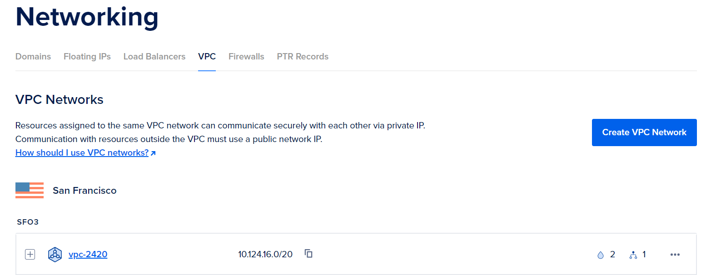

Good job! You have created a VPC.

---

## <ins>**Create Droplets**</ins>

1. Create a new SSH key pair of your choice on your machine. You can do this by running the following command in your terminal:

```
ssh-keygen [OPTIONS]
```

2. Copy the contents of the public key file (the one with the `.pub` extension) and paste it into the SSH keys section of your DigitalOcean account.


3. Click on the green `Create` button to create new droplets.

4. Select `vpc-2420` as the VPC Network.

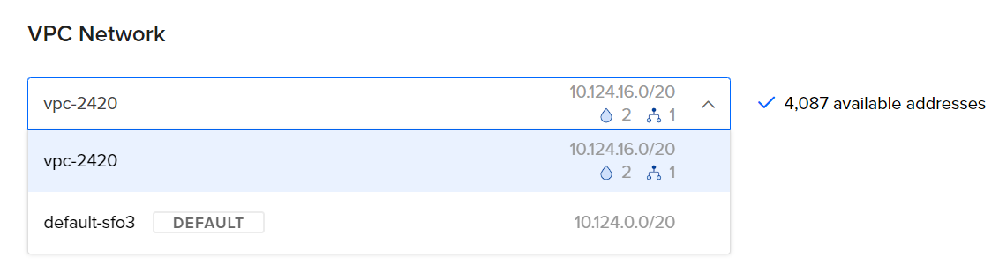

5. Select either `Ubuntu 22.10` or `Ubuntu 22.04` as the image.

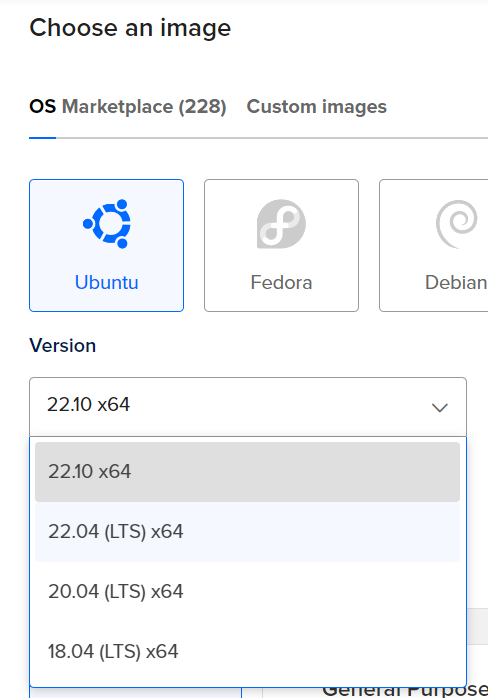

6. Select your SSH key that you created earlier.

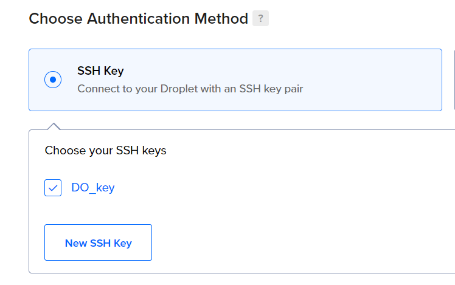

7. Add 2 droplets with the following settings:

   - Tags: `Web`

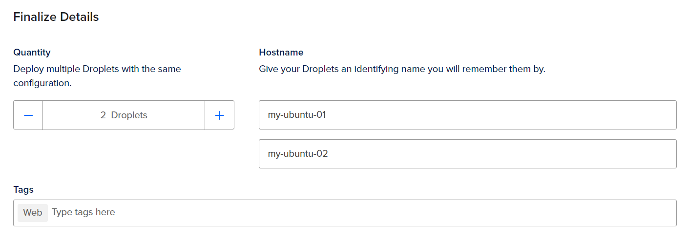

8. Finally, create the droplets.

Good job! You have created your droplets.

---

## <ins>**Create Load Balancer**</ins>

1. Create a new load balancer with the following settings:

   - Droplets: `Web`
   - Health Check: `HTTP`
   - Port: `80`
   - VPC: `vpc-2420`

2. Finally, create the load balancer.

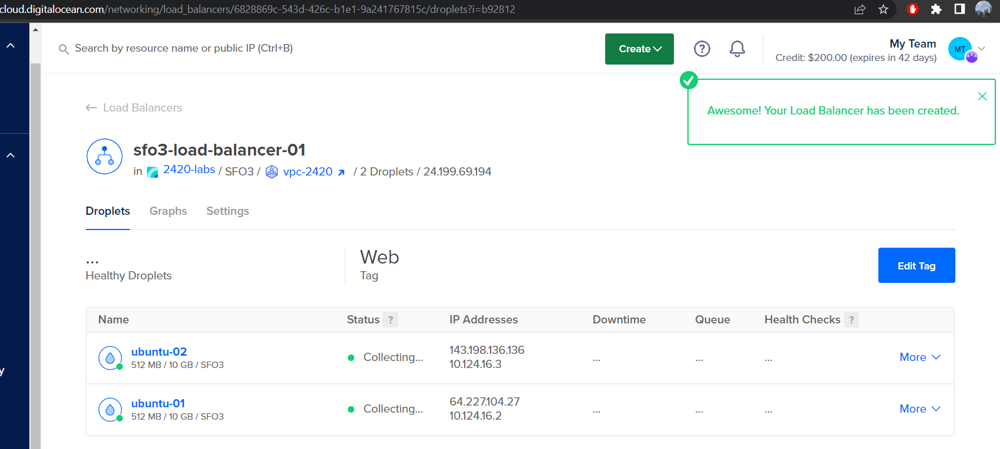

Awesome! You have created a load balancer.

---

## <ins>**Create Firewall**</ins>

1. Create a new firewall with the following settings:

   - VPC: `vpc-2420`
   - Inbound Rules: `HTTP` and `SSH`

2. For the `HTTP` rule, select the load balancer that you created earlier.

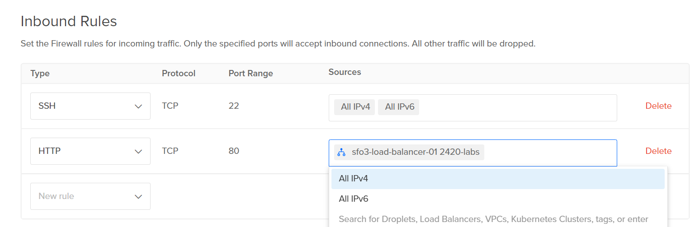

3. Apply your droplets and create the firewall.

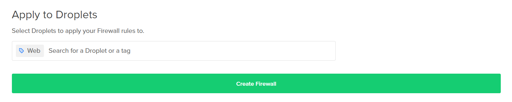

Nice! You have created a firewall.

> **Note:** You have reached the end of the DO setup.

---

# <ins>**Create New Regular User**</ins>

Below, you will be creating a new regular user on both of your droplets.

> **Note:** To make your life easier, you can copy and paste the commands from the first droplet to the second one on a 2nd Terminal.

1. From WSL, SSH connect into your first droplet.

```
ssh -i ~/.ssh/<sshkey_name> root@<droplet-ip>
```

2. Create a new user with the following conditions:

   - Add to `sudo` group
   - Create a home directory
   - Create a password
   
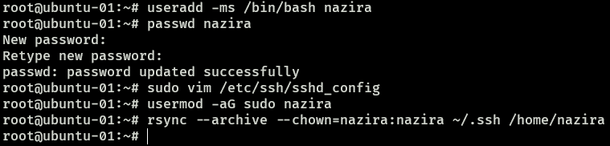

3. Exit the root user and SSH into your new user.

```
ssh -i ~/.ssh/<sshkey_name> <username>@<droplet-ip>
```

4. Edit the `/etc/ssh/sshd_config` file with `vim` or `vi` and change the following settings:

   - `PermitRootLogin` to `no`

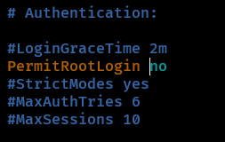

5. Restart the SSH service.

```
username@droplet:~$ sudo service restart ssh
```

6. Update any installed packages.

```
username@droplet:~$ sudo apt update && sudo apt upgrade
```

7. Press `TAB` and hit `ENTER` to exit the services GUI.

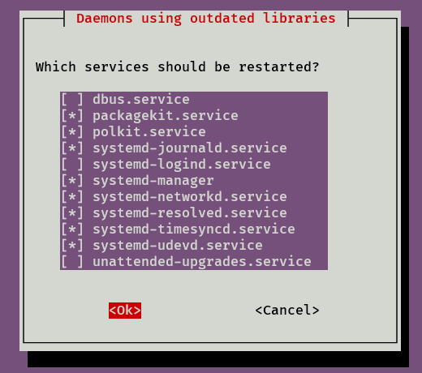

Great. You have created a new regular user. Repeat the above steps for the second droplet.

---

# <ins>**Install Caddy Web Server**</ins>

Below, you will be installing Caddy on both of your droplets. Again, you can copy and paste the commands from the first droplet to the second one on a 2nd Terminal.

1. Install Caddy on your first droplet.

```
username@droplet:~$ wget https://github.com/caddyserver/caddy/releases/download/v2.6.2/caddy_2.6.2_linux_amd64.tar.gz
```

Desired output:  
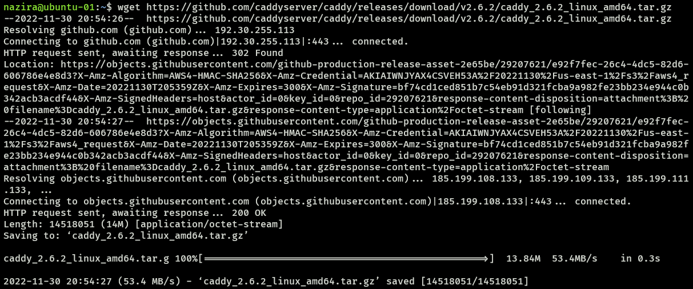

2. Extract the `tar.gz` file.

```
username@droplet:~$ tar xvf caddy_2.6.2_linux_amd64.tar.gz
```

Desired output:  
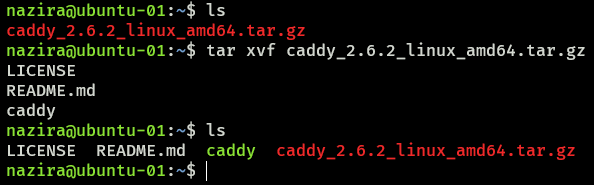

We will configure this later. Repeat the above steps for the second droplet.

---


---

# [<ins>**Go to top**</ins>](#2420-assignment-2)