# <ins>**2420 Assignment 2**</ins>

> **IMPORTANT** My load balancer ip address: http://24.199.69.194/

This repo contains files for the second assignment.

In this README, you will be building a VPC that has a load balancer which distributes HTTP traffic to your servers and a firewall that allows incoming SSH and HTTP traffic.

This README mainly focuses on Window users.

---

# <ins>**Table of Content**</ins>

- [**2420 Assignment 2**](#2420-assignment-2)
- [**Table of Content**](#table-of-content)
- [**Set B Members**](#set-b-members)
- [**Technologies Used**](#technologies-used)
- [**Prerequisites**](#prerequisites)
- [**DO Setup**](#do-setup)
  - [**Create VPC**](#create-vpc)
  - [**Create Droplets**](#create-droplets)
  - [**Create Load Balancer**](#create-load-balancer)
  - [**Create Firewall**](#create-firewall)
- [**Create New Regular User**](#create-new-regular-user)
- [**Install Caddy Web Server**](#install-caddy-web-server)
- [**Write the Web App**](#write-the-web-app)
- [**Move the Web App**](#move-the-web-app)
- [**Configure Caddy**](#configure-caddy)
- [**Install node and npm with Volta**](#install-node-and-npm-with-volta)
- [**Create Caddy Service File**](#create-caddy-service-file)
- [**Node Service File**](#node-service-file)
- [**Go to top**](#go-to-top)

---

# <ins>**Set B Members**</ins>

- Nazira Fakhrurradi (A01279940)

---

# <ins>**Technologies Used**</ins>

- Bash
- WSL Ubuntu
- DigitalOcean (DO)
- Caddy
- GitHub
- Windows Terminal or Powershell
- Volta (Node.js version manager)
- Fastify (Node.js web framework)

---

# <ins>**Prerequisites**</ins>

- A DigitalOcean account
- WSL Ubuntu installed on your machine (with a regular user created)

---

# <ins>**DO Setup**</ins>

Below, you will be creating your own VPC, DO droplets, and load balancer.

## <ins>**Create VPC**</ins>

1. Create a new VPC with the following settings:

   - Name: `vpc-2420`
   - Recommended IP Range


Good job! You have created a VPC.

---

## <ins>**Create Droplets**</ins>

1. Create a new SSH key pair of your choice on your machine. You can do this by running the following command in your terminal:

```
ssh-keygen [OPTIONS]
```

2. Copy the contents of the public key file (the one with the `.pub` extension) and paste it into the SSH keys section of your DigitalOcean account.


3. Click on the green `Create` button to create new droplets.

4. Select `vpc-2420` as the VPC Network.


5. Select either `Ubuntu 22.10` or `Ubuntu 22.04` as the image.


6. Select your SSH key that you created earlier.


7. Add 2 droplets with the following settings:

   - Tags: `Web`


8. Finally, create the droplets.

Good job! You have created your droplets.

---

## <ins>**Create Load Balancer**</ins>

1. Create a new load balancer with the following settings:

   - Droplets: `Web`
   - Health Check: `HTTP`
   - Port: `80`
   - VPC: `vpc-2420`

2. Finally, create the load balancer.


Awesome! You have created a load balancer.

---

## <ins>**Create Firewall**</ins>

1. Create a new firewall with the following settings:

   - VPC: `vpc-2420`
   - Inbound Rules: `HTTP` and `SSH`

2. For the `HTTP` rule, select the load balancer that you created earlier.


3. Apply your droplets and create the firewall.


Nice! You have created a firewall.

> **Note:** You have reached the end of the DO setup.

---

# <ins>**Create New Regular User**</ins>

Below, you will be creating a new regular user on both of your droplets.

> **Note:** To make your life easier, you can copy and paste the commands from the first droplet to the second one on a 2nd Terminal.

1. From WSL, SSH connect into your first droplet.

```
ssh -i ~/.ssh/<sshkey_name> root@<droplet-ip>
```

2. Create a new user with the following conditions:

   - Add to `sudo` group
   - Create a home directory
   - Create a password
   


3. Exit the root user and SSH into your new user.

```
ssh -i ~/.ssh/<sshkey_name> <username>@<droplet-ip>
```

4. Edit the `/etc/ssh/sshd_config` file with `vim` or `vi` and change the following settings:

   - `PermitRootLogin` to `no`


5. Restart the SSH service.

```
username@droplet:~$ sudo service restart ssh
```

6. Update any installed packages.

```
username@droplet:~$ sudo apt update && sudo apt upgrade
```

7. Press `TAB` and hit `ENTER` to exit the services GUI.


Great. You have created a new regular user. Repeat the above steps for the second droplet.

---

# <ins>**Install Caddy Web Server**</ins>

Below, you will be installing Caddy on both of your droplets. Again, you can copy and paste the commands from the first droplet to the second one on a 2nd Terminal.

1. Install Caddy on your first droplet.

```
username@droplet:~$ wget https://github.com/caddyserver/caddy/releases/download/v2.6.2/caddy_2.6.2_linux_amd64.tar.gz
```

Desired output:  


2. Extract the `tar.gz` file.

```
username@droplet:~$ tar -xvf caddy_2.6.2_linux_amd64.tar.gz
```

Desired output:  


We will configure this later. Repeat the above steps for the second droplet.

---

# <ins>**Write the Web App**</ins>

Below, you will be writing a simple web app.

1. Create a new directory on `WSL` called `2420-assign-two`.
   
```
username@wsl:~$ mkdir 2420-assign-two
```

2. In the `2420-assign-two` directory, create two directories called `html` and `src`.

```
username@wsl:~$ mkdir 2420-assign-two/html && mkdir 2420-assign-two/src
```

3. Create a simple, but complete `index.html` file in the `html` directory.

```
username@wsl:~$ vim 2420-assign-two/html/index.html
```

4. Inside the `src` directory, create a new node project.

```
username@wsl:~$ cd 2420-assign-two/src && curl https://get.volta.sh | bash

username@wsl:~/2420-assign-two/src$ source ~/.bashrc

username@wsl:~/2420-assign-two/src$ volta install node

username@wsl:~/2420-assign-two/src$ npm init

username@wsl:~/2420-assign-two/src$ npm install fastify
```

Desired output:  
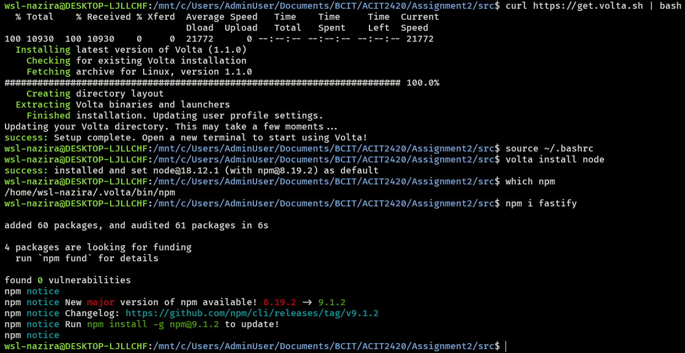

> **Note:** If you do not have `npm`, you can try installing it with `sudo apt install npm` or `volta install npm`.

5. Create a new file called `index.js` and add the following fastify code.

```
// Require the framework and instantiate it
const fastify = require('fastify')({ logger: true })

// Declare a route
fastify.get('/api', async (request, reply) => {
  return { hello: 'Server x' }
})

// Run the server!
const start = async () => {
  try {
    await fastify.listen({ port: 5050 })
  } catch (err) {
    fastify.log.error(err)
    process.exit(1)
  }
}
start()
```

6. Test your server locally, and go to the provided link.

```
username@wsl:~/2420-assign-two/src$ node index.js
```

Desired outputs:  
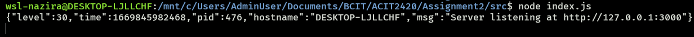  

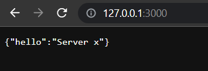

7. Finally, copy your `2420-assign-two` directory to both your droplets.

```
username@wsl:~$ rsync -r 2420-assign-two "<username>@<droplet-ip>:~/" -e "ssh -i ~/.ssh/<sshkey-name> -o StrictHostKeyChecking=no"
```

Desired output:  
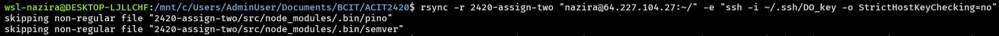

Good job. You have written a simple web app.

---

# <ins>**Move the Web App**</ins>

Below, you will be moving the web app from both of your droplets.

1. Move the `index.html` file to `/var/www/html/` directory.

```
username@droplet:~$ sudo mkdir -p /var/www/html/
username@droplet:~$ sudo mv ~/2420-assign-two/html/index.html /var/www/html/
```

2. Move the `2420-assign-two/src` directory to `/var/www/` directory.

```
username@droplet:~$ sudo mv ~/2420-assign-two/src /var/www/
```

Desired output:  
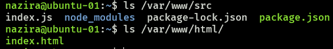

> **IMPORTANT:** Repeat the above steps for the second droplet, but this time, change the structure of the `index.html` file to show that it is from the second server.

---

# <ins>**Configure Caddy**</ins>

Below, you will be configuring Caddy for both of your droplets.

1. In `WSL`, create a new file called `Caddyfile` in the `2420-assign-two` directory with the following content.

```
http:// {
    root * /var/www/html
    reverse_proxy /api localhost:5050
    file_server
}
```

2. Again, copy the `2420-assign-two` directory to both your droplets.

```
username@wsl:~$ rsync -r 2420-assign-two "<username>@<droplet-ip>:~/" -e "ssh -i ~/.ssh/<sshkey-name> -o StrictHostKeyChecking=no"
```

3. In both your droplets, move the `Caddyfile` to the `/etc/caddy` directory.

```
username@droplet:~$ sudo mkdir /etc/caddy/

username@droplet:~$ sudo cp 2420-assign-two/Caddyfile /etc/caddy/
```

4. In both your droplets, move the `caddy` binary that we installed previously to the `/usr/bin` directory.

```
username@droplet:~$ sudo cp caddy /usr/bin/
```

Desired output:  
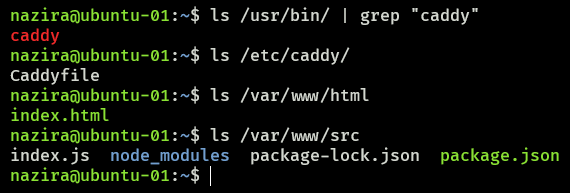

Nice job. You have configured your Caddyfile.

---

# <ins>**Install node and npm with Volta**</ins>

Below, you will be installing node and npm with Volta for both of your droplets.

1. In both your droplets, install node and npm with Volta.

```
username@droplet:~$ curl https://get.volta.sh | bash
username@droplet:~$ source ~/.bashrc
username@droplet:~$ volta install node
username@droplet:~$ volta install npm
```

Desired output:  
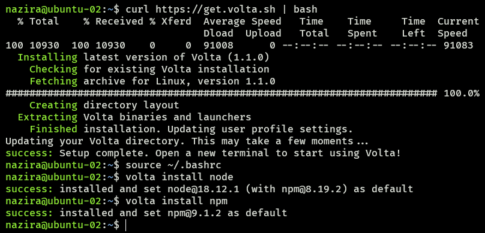

---

# <ins>**Create Caddy Service File**</ins>

Below, you will be creating a Caddy service file for both of your droplets.

1. In `WSL`, create a new file called `caddy.service` in the `2420-assign-two` directory with the following content.

```
[Unit]
Description=Serve HTML in /var/www using caddy
After=network.target

[Service]
Type=notify
ExecStart=/usr/bin/caddy run --config /etc/caddy/Caddyfile
ExecReload=/usr/bin/caddy reload --config /etc/caddy/Caddyfile
TimeoutStopSec=5
KillMode=mixed

[Install]
WantedBy=multi-user.target
```

3. Again, copy the `2420-assign-two` directory to both your droplets.

2. In both your droplets, start and enable the Caddy service.

```
username@droplet:~$ sudo systemctl daemon-reload
username@droplet:~$ sudo systemctl start caddy
username@droplet:~$ sudo systemctl enable --now caddy
```

3. Finally, check the status.

```
username@droplet:~$ sudo systemctl status caddy
```

Desired output:  
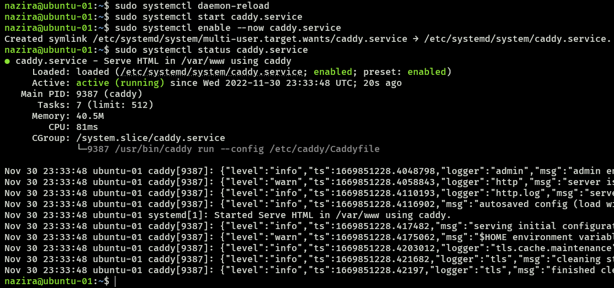

---

# <ins>**Node Service File**</ins>

Below, you will be writing the node service file for both of your droplets.

1. In `WSL`, create a new file called `hello_web.service` in the `2420-assign-two` directory with the following content.

```
[Unit]
Description=run node application service file
After=network.target

[Service]
Type=simple
User=<username>
Group=<username>
ExecStart=/home/<username>/.volta/bin/node /var/www/src/index.js
Restart=on-failure
RestartSec=5
SyslogIdentifier=hello_web

[Install]
WantedBy=multi-user.target
```

2. Again, copy the `2420-assign-two` directory to both your droplets.

```
username@wsl:~$ rsync -r 2420-assign-two "<username>@<droplet-ip>:~/" -e "ssh -i ~/.ssh/<sshkey-name> -o StrictHostKeyChecking=no"
```

3. In both your droplets, move the `hello_web.service` file to the `/etc/systemd/system` directory.

```
username@droplet:~$ sudo cp 2420-assign-two/hello_web.service /etc/systemd/system/
```

4. Start and enable the node service.

```
username@droplet:~$ sudo systemctl daemon-reload
username@droplet:~$ sudo systemctl start hello_web
username@droplet:~$ sudo systemctl enable --now hello_web
```

Desired output:  
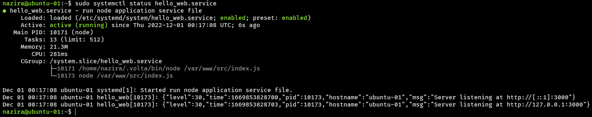

5. Finally, check the load balancer IP address.

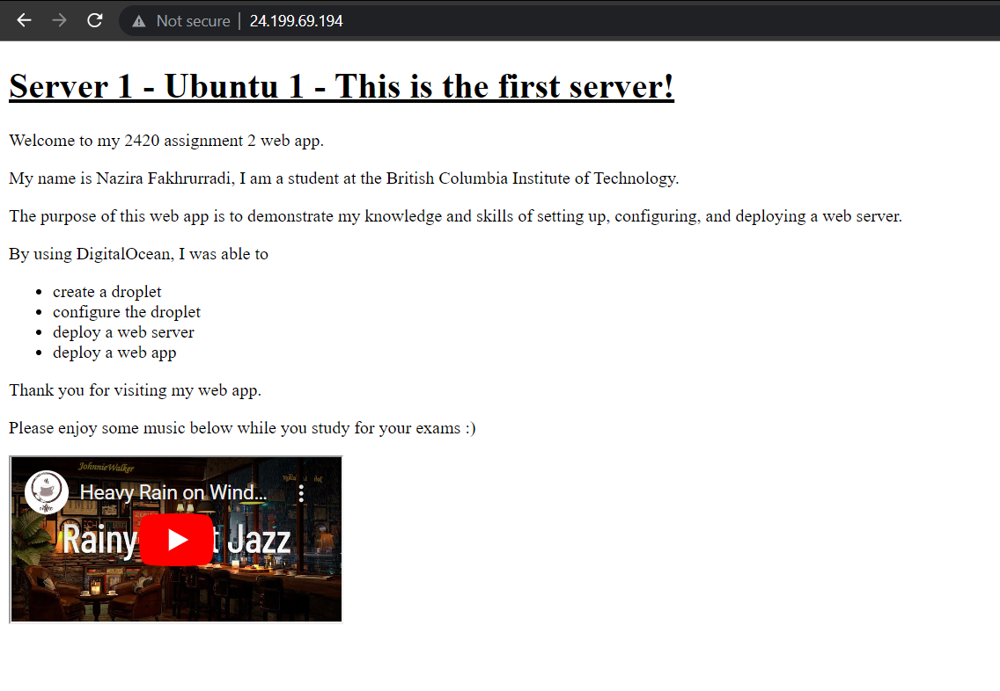

- Droplet 2:

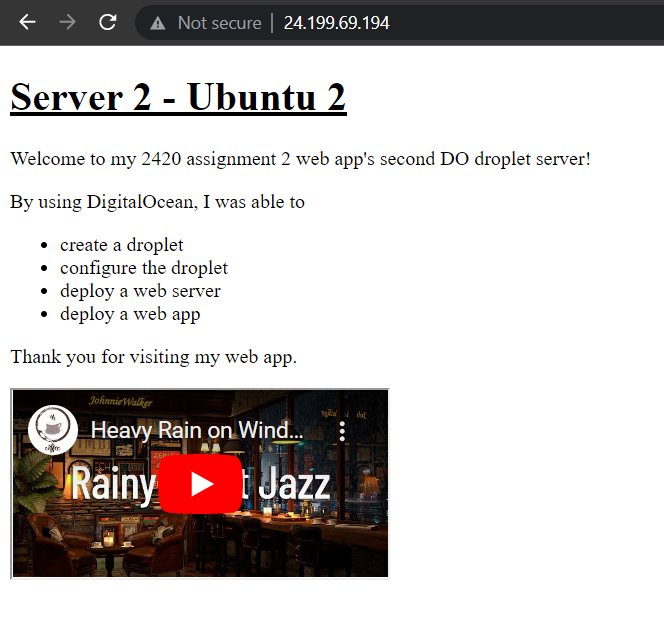

- Both droplets:

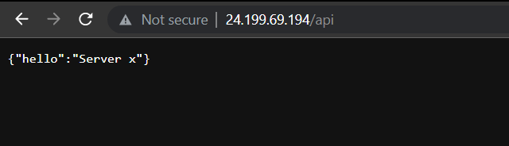

> **Note:** If you can see the output of the `index.html` file from both droplets, then you have successfully completed the walkthrough.

# [<ins>**Go to top**</ins>](#2420-assignment-2)