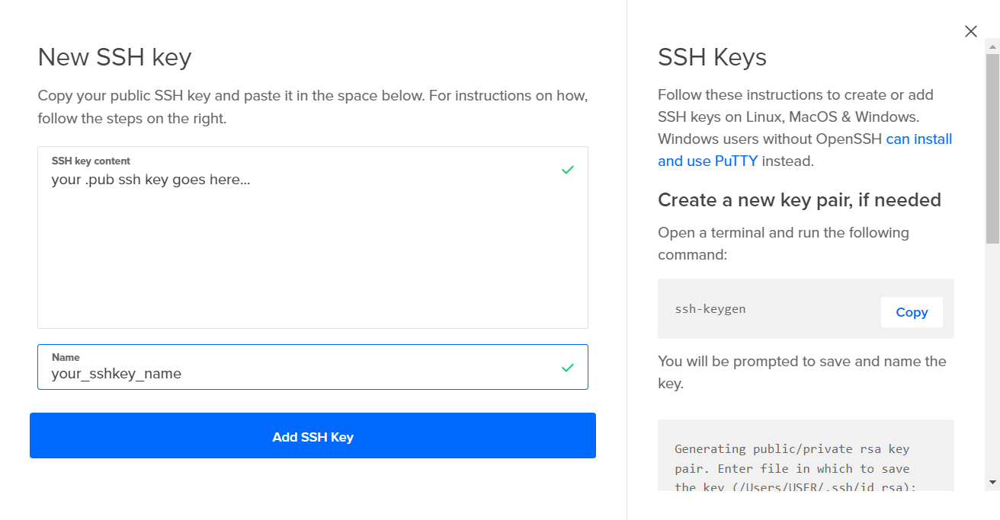

# <ins>**2420 Assignment 2**</ins>

This repo contains files for the second assignment.

In this README, you will be building a VPC that has a load balancer which distributes HTTP traffic to your servers and a firewall that allows incoming SSH and HTTP traffic.

---

# <ins>**Table of Content**</ins>

- [**2420 Assignment 2**](#2420-assignment-2)
- [**Table of Content**](#table-of-content)
- [**Set B Members**](#set-b-members)
- [**Technologies Used**](#technologies-used)
- [**Prerequisites**](#prerequisites)
- [**Instructions**](#instructions)
  - [**Creating VPC**](#creating-vpc)
  - [**Creating Droplets**](#creating-droplets)
  - [**Creating Load Balancer**](#creating-load-balancer)
  - [**Creating Firewall**](#creating-firewall)

---

# <ins>**Set B Members**</ins>

- Nazira Fakhrurradi (A01279940)

---

# <ins>**Technologies Used**</ins>

- Bash
- WSL Ubuntu
- DigitalOcean (DO)
- Caddy
- GitHub
- Windows Terminal or Powershell
- Volta (Node.js version manager)
- Fastify (Node.js web framework)

---

# <ins>**Prerequisites**</ins>

- A DigitalOcean account
- WSL Ubuntu installed on your machine (with a regular user created)

---

# <ins>**Instructions**</ins>

Below, you will be creating your own VPC, DO droplets, and load balancer.

## <ins>**Creating VPC**</ins>

1. Create a new VPC with the following settings:

   - Name: `vpc-2420`
   - Recommended IP Range


Good job! You have created a VPC.

---

## <ins>**Creating Droplets**</ins>

1. Create a new SSH key pair on your machine. You can do this by running the following command in your terminal:

```
ssh-keygen
```

2. Copy the contents of the public key file (the one with the `.pub` extension) and paste it into the SSH keys section of your DigitalOcean account.



3. Click on the green `Create` button to create new droplets.

4. Select `vpc-2420` as the VPC Network.


5. Select either `Ubuntu 22.10` or `Ubuntu 22.04` as the image.


6. Select your SSH key that you created earlier.


7. Add 2 droplets with the following settings:

   - Tags: `Web`


8. Finally, create the droplets.

Good job! You have created your droplets.

---

## <ins>**Creating Load Balancer**</ins>

1. Create a new load balancer with the following settings:

   - Droplets: `Web`
   - Health Check: `HTTP`
   - Port: `80`
   - VPC: `vpc-2420`

2. Finally, create the load balancer.


Awesome! You have created a load balancer.

---

## <ins>**Creating Firewall**</ins>

1. Create a new firewall with the following settings:

   - VPC: `vpc-2420`
   - Inbound Rules: `HTTP` and `SSH`

2. For the `HTTP` rule, select the load balancer that you created earlier.


3. Apply your droplets and create the firewall.


---

